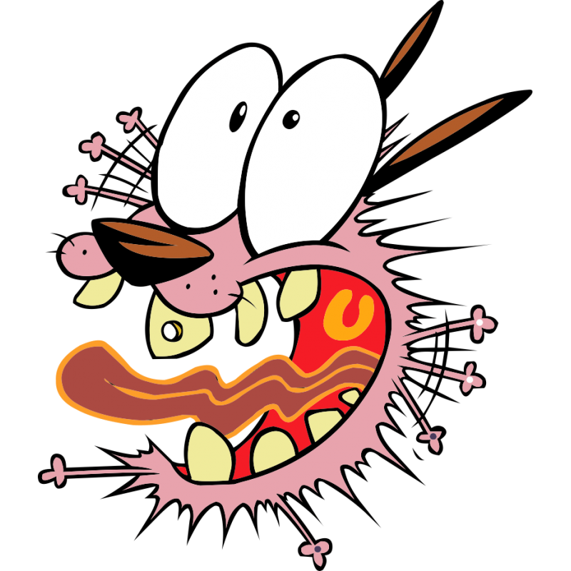

<p align="center">
  
</p>

<h1 align="center">🏠 Deepan's Courage Theme Portfolio</h1>

<p align="center">
  <strong>An immersive 3D portfolio experience built with React Three Fiber</strong>
</p>

<p align="center">
  
  
  
  
</p>

---

## 🎬 About

A unique interactive portfolio website inspired by **Courage the Cowardly Dog** 🐕. The entire experience takes place inside a fully explorable 3D house modeled in Blender, where visitors scroll through different rooms to discover:

- **Welcome Section** — An outdoor approach towards the house
- **About Me** — Introduction as a Junior Software Developer (B.Tech CSE)
- **Living Room** — TV playing a showcase video, cartoon-themed décor
- **Education** — Academic details (B.Tech VTU & Diploma KMPTC)
- **Skills Showcase** — A shelf with framed skill icons (Flutter, React, Three.js, Java, Python, etc.)
- **Projects Gallery** — Photo frames displaying project cards
- **Contact Section** — Social links via a virtual PC screen (GitHub, LinkedIn, Instagram, WhatsApp, Email, Resume)

## ✨ Features

| Feature | Description |
|---------|-------------|
| 🏡 **3D House Model** | Custom Blender-modeled house with textured interiors |
| 📜 **Scroll-Driven Camera** | GSAP-powered camera path through 14 pages of scrollable content |
| 🚪 **Interactive Doors** | Doors that animate open as you scroll through the house |
| 📺 **Video Texture** | Real video playing on the in-world TV screen |
| 🎨 **Skill Shelf** | Animated cabinet doors revealing skill icons |
| 🌤️ **Dynamic Sky & Clouds** | Atmospheric sky with floating clouds |
| 🏗️ **Windmill** | A continuously rotating windmill in the background |
| 📱 **Responsive** | Adaptive FOV and scroll helper for mobile devices |
| ⚡ **Performance** | Optimized with memoized video textures and proper asset preloading |

## 🛠️ Tech Stack

- **Frontend Framework** — [React 18](https://react.dev/)
- **3D Rendering** — [Three.js](https://threejs.org/) via [React Three Fiber](https://docs.pmnd.rs/react-three-fiber)
- **3D Helpers** — [Drei](https://github.com/pmndrs/drei) (ScrollControls, Environment, Clouds, Text, Html, etc.)
- **Animations** — [GSAP](https://gsap.com/) for scroll-based camera timeline
- **3D Modeling** — [Blender](https://www.blender.org/) (exported as `.glb`)
- **Build Tool** — [Vite](https://vite.dev/)
- **Analytics** — [Vercel Analytics](https://vercel.com/analytics) & [Speed Insights](https://vercel.com/docs/speed-insights)
- **Deployment** — [Vercel](https://vercel.com/)

## 📁 Project Structure

```
newPortfolio/
├── public/
│   ├── Model/
│   │   ├── Model.jsx          # Main 3D house component (auto-generated via gltfjsx)
│   │   ├── model.glb           # Main house 3D model
│   │   ├── courageHouse.glb    # Alternate house model
│   │   └── CourageHouse.jsx    # Alternate house component
│   ├── Textures/
│   │   ├── skills/             # Skill icon textures (flutter, react, java, etc.)
│   │   ├── ground.jpg          # Ground plane texture
│   │   ├── wallpaper.jpg       # Interior wall texture
│   │   ├── roof.jpg            # Roof texture
│   │   └── ...                 # Other material textures
│   ├── Logo/                   # Brand logos and social icons
│   ├── Resume/                 # Downloadable resume PDF
│   ├── fonts/                  # Custom fonts (Bangers, Roboto)
│   └── tv.mp4                  # Video playing on the in-world TV
├── src/
│   ├── main.jsx                # Entry point — Canvas setup, Suspense, Loader
│   ├── App.jsx                 # Scene composition (Sky, Clouds, Model, ScrollControls)
│   ├── MyCameraControll.jsx    # GSAP scroll-based camera animation timeline
│   ├── Model/
│   │   └── TVScreen.jsx        # TV screen component (alternate)
│   ├── components/
│   │   ├── Loader.jsx          # Loading screen with progress bar & fade-out
│   │   ├── Loader.css          # Loader styles & animations
│   │   ├── Scrollhelper.jsx    # Scroll hint overlay for new visitors
│   │   └── styles.css          # Additional styles
│   ├── projects.json           # Project data for the gallery
│   ├── index.css               # Global styles
│   └── App.css                 # App-level styles
├── index.html                  # HTML entry point
├── vite.config.js              # Vite configuration
├── package.json                # Dependencies & scripts
└── pnpm-lock.yaml              # pnpm lockfile
```

## 🚀 Getting Started

### Prerequisites

- [Node.js](https://nodejs.org/) (v18 or higher recommended)
- [pnpm](https://pnpm.io/) (v8 or higher)

### Installation

```bash
# Clone the repository
git clone https://github.com/deepan1413/newPortfolio.git
cd newPortfolio

# Install dependencies
pnpm install
```

### Development

```bash
# Start local dev server
pnpm dev

# Start dev server on local network (accessible from other devices)
pnpm dev --host
```

### Production Build

```bash
# Build for production
pnpm build

# Preview the production build locally
pnpm preview
```

## 🎮 How to Navigate

1. **Desktop** — Scroll down with your mouse wheel to move through the house
2. **Mobile** — Swipe up to scroll through the portfolio
3. If you haven't scrolled after 4 seconds, a scroll hint icon will appear

## 📊 Performance Notes

- **3D Models** are loaded via `useGLTF` with preloading enabled
- **Video textures** are memoized to prevent recreation on re-renders
- **Loader** shows progress of asset downloads, then stays visible briefly to ensure external CDN textures (social icons) finish loading before revealing the scene
- **Environment map** uses the `city` preset from `@react-three/drei`
- Total asset weight: ~15MB (GLB models + textures + video)

## 🔗 Links

| Platform | URL |
|----------|-----|
| 🌐 **Live Site** | [deepanportfolio.vercel.app](https://deepanportfolio.vercel.app) |
| 💻 **GitHub** | [github.com/deepan1413](https://github.com/deepan1413) |
| 💼 **LinkedIn** | [linkedin.com/in/deepan-l](https://www.linkedin.com/in/deepan-l-3aabb425b) |
| 📸 **Instagram** | [@deepan_wolfie](https://www.instagram.com/deepan_wolfie/) |
| 📄 **Resume** | [Download PDF](https://deepanportfolio.vercel.app/Resume/Deepan_Resume.pdf) |

## 📜 License

This project is open source and available under the [MIT License](LICENSE).

---

<p align="center">
  Made with ❤️ and 🐕 Courage by <strong>Deepan L</strong>
</p>